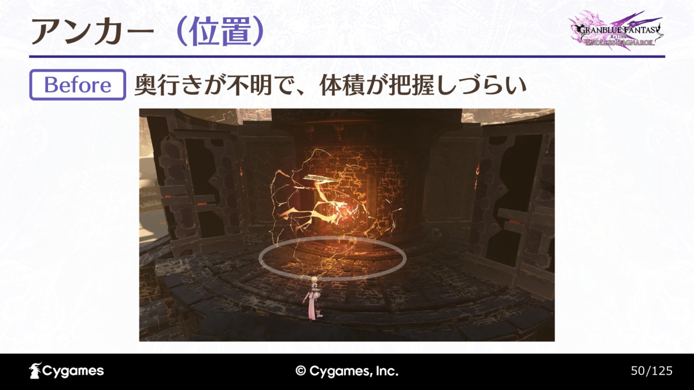
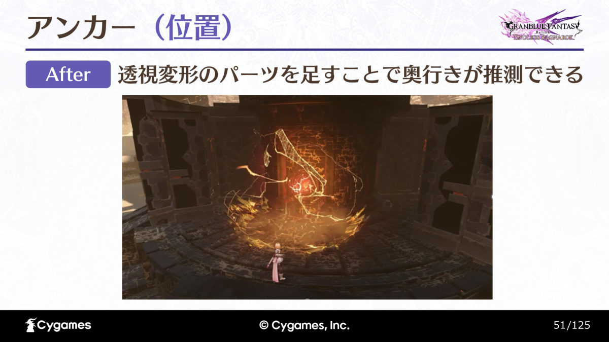
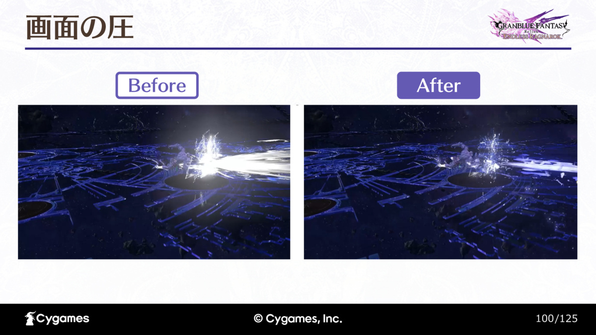

## 特效首先是一条供玩家判断的信息

- **看见—判断—输入的链路**: 动作战斗包含看见、判断和输入三个阶段。
- **VFX 直接改变判断链路**: 特效既要表达角色、技能与世界观，也会直接改变这条链路——玩家能否看清作用范围、是否知道攻击正在接近、能否在正确时刻回避。（第 10—30 页）
- **四人战斗放大要求**: 单个技能漂亮不代表同屏效果可读，四人战斗把这些要求进一步放大。
- **两个尺度的处理顺序**: 讲义先让单个特效的信息明确，再控制多个特效叠加后的画面；前者关心边缘、空间锚点与明度主次，后者关心持续时间、近距离压迫和空间密度。

## 硬边缘留住视线，软边缘让次要部分退后

- **硬边缘 = 信息中心**: 硬边缘容易让视线停留，适合作为信息中心；软边缘更容易融入环境。
- **主次分配而非二选一**: 两种边缘并非只能择一的风格，同一个效果也需要分配主次——关键形状要容易识别，外围气氛可以柔化。（第 35—40 页）
- **小结**：检查特效时可先暂时忽略颜色和粒子数量，只看轮廓哪里最清楚；如果所有地方都拥有同样鲜明的边界，玩家仍然不知道该关注哪一部分。

## 三类锚点：在哪里、往哪走、何时生效

- **锚点的定义**: 讲者用「锚点」描述把模糊的视觉印象转成可行动线索的方法。
- **三类锚点不可互相替代**: 位置、方向与时机各自回答不同问题，不能互相替代。（第 47 页）

### 位置锚点：让体积和距离有参照

- **问题：发光形状 ≠ 体积判断**: 原版能量效果虽有鲜明的线条，纵深却不容易判断；只给玩家一个发光形状，不能保证他们理解它在三维空间占据多大范围。（第 48—50 页）

*图：Cygames／蔦直樹，原讲义第 50 页。此页用于说明“看见效果”与“判断体积”的区别。*

- **改版加入透视线索**: 改版加入体现透视变化的部分，让玩家可由底部与展开轮廓估计纵深。（第 51—52 页）
- **与碰撞判定对照**: 后续一页把效果与引擎中的实际碰撞判定一起展示，核对视觉读到的范围是否对应真实作用范围。

*图：同讲义第 51 页。对照上一图，重点看靠近地面的透视线索，而不是只比较亮度。*

### 方向锚点：流动感需要转成明确去向

- **粒子流动 ≠ 明确去向**: 有粒子流动并不意味着玩家知道攻击会去哪里。
- **形状与运动形成方向**: 讲义用向外扩散的攻击说明，形状与运动需要形成容易辨认的方向，玩家才能据此选择回避路线。（第 55—60 页）

### 时机锚点：危险何时到达也必须可读

- **位置 ≠ 时机**: 火焰区域的前后对比关注生效时机；位置明确只回答「这里危险」，还要让玩家读懂「现在是否已经危险」。（第 61—64 页）
- **连续演示观察时间变化**: 讲义中的连续演示用于观察这一时间变化。
- **边界说明**: 单张截图不能推出精确的预警时长或判定帧数。

## 明度主次，决定多个效果叠加后还剩什么

- **整体提亮导致饱和**: 把整个效果一起提亮，会导致内部信息趋于饱和。
- **圆点与蓝色斩击演示**: 讲义先用不同明度的圆点解释主从关系，再以蓝色斩击演示——单个效果很醒目，实际战斗里多个亮面叠加后却挤满视野。（第 70—75 页）
- **把明度集中到关键位置**: 需要把明度集中到「希望玩家读到」的位置，其他部分相应退后。
- **边界说明**: 这里调的是注意力分配，不能简单理解为整体降亮度，也不能仅在空场景中评估效果。

## 时间、强度、空间：分别处理画面拥挤

### 余效持续多久，会改变下一招的可见性

- **余效残留占据画面**: 攻击结束后的残光、粒子和余波仍占据画面。
- **单次完整 ≠ 持续可读**: 单次播放时显得完整的尾韵，在持续输出时会叠加成遮挡；讲义用粉色效果从单独播放到实战重叠的变化说明这一点。（第 83—90 页）
- **检查余效的判断价值**: 需检查攻击结束之后还留下什么，以及下一轮攻击到来时这些元素是否仍有判断价值；持续时间也是战斗参数。

### 靠近镜头时，不能只靠透明淡出

- **贴近镜头占据大面积**: 特效贴近镜头会占据很大面积。
- **相机淡出存在问题**: 讲义指出直接使用相机淡出在观感上存在问题。
- **与距离关联的明度限制**: 随后展示与距离关联的明度限制——保留形状，同时控制近处亮光对画面的压迫。（第 94—100 页）

*图：Cygames 原讲义第 100 页。右图的意义是恢复层次与背景可见性，不是让技能完全消失。*

### 按信息用途删减，而不只按特效归属

- **按信息用途取舍**: 讲义给出的密度取舍如下。（第 110—111 页）

| 优先减少 | 优先保留 |
| --- | --- |
| 其他玩家攻击的低优先级余波 | 敌人攻击与危险范围 |
| 装饰粒子 | 自己的攻击反馈 |
| 不影响当前判断的表现 | 增益、屏障与治疗区域 |

- **治疗区域也可能来自队友**: 治疗区域也可能来自队友，因此规则并不是「只显示自己」。
- **三档显示量**: 另有通常、稍少、少三档显示量选项，但核心判断信息需要保留。

## 设计启发：从一次正确判断开始验收

> ✦ 一句话总结：可读性评审可以要求测试者指出攻击的位置、方向和生效时刻，再让四人连续出招，检查这些答案是否仍成立。若失败，再分别排查边缘、空间参照、明度、余效和同屏装饰，避免把所有问题笼统归结为"特效太花"。
